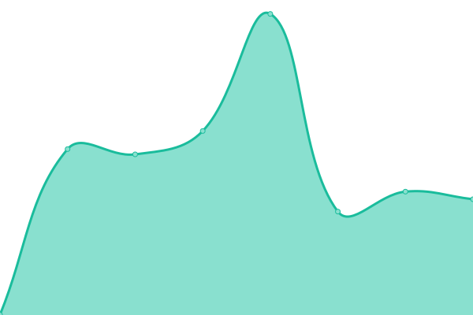
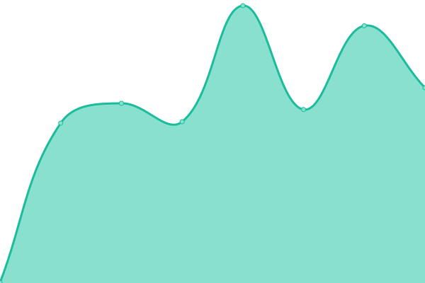
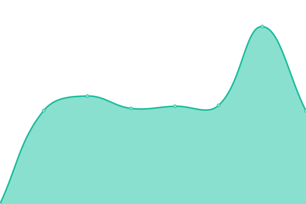

# [📈 Live Status](https://principalstudio.github.io/uptime-dmc-website): <!--live status--> **🟩 All systems operational**

This repository contains the open-source uptime monitor and status page for [Principal Studio](https://principal.studio), powered by [Upptime](https://github.com/upptime/upptime).

With [Upptime](https://upptime.js.org), you can get your own unlimited and free uptime monitor and status page, powered entirely by a GitHub repository. We use [Issues](https://github.com/principalstudio/uptime-dmc-website/issues) as incident reports, [Actions](https://github.com/principalstudio/uptime-dmc-website/actions) as uptime monitors, and [Pages](https://principalstudio.github.io/uptime-dmc-website) for the status page.

<!--start: status pages-->
<!-- This summary is generated by Upptime (https://github.com/upptime/upptime) -->
<!-- Do not edit this manually, your changes will be overwritten -->
<!-- prettier-ignore -->
| URL | Status | History | Response Time | Uptime |
| --- | ------ | ------- | ------------- | ------ |
|  [Homepage](https://www.dawsonmetal.com) | 🟩 Up | [homepage.yml](https://github.com/principalstudio/dmc-system-status/commits/HEAD/history/homepage.yml) | 

 1009ms
     
 | 

<a href="https://principalstudio.github.io/dmc-system-status/history/homepage">100.00%</a>
    

|  [Architectural Entrances](https://www.dawsonmetal.com/architectural-entrances) | 🟩 Up | [architectural-entrances.yml](https://github.com/principalstudio/dmc-system-status/commits/HEAD/history/architectural-entrances.yml) | 

 765ms
     
 | 

<a href="https://principalstudio.github.io/dmc-system-status/history/architectural-entrances">100.00%</a>
    

|  [Custom Series](https://www.dawsonmetal.com/architectural-entrances/products/custom-series) | 🟩 Up | [custom-series.yml](https://github.com/principalstudio/dmc-system-status/commits/HEAD/history/custom-series.yml) | 

 798ms
     
 | 

<a href="https://principalstudio.github.io/dmc-system-status/history/custom-series">100.00%</a>
    

|  [Ultra Narrow Stile Series](https://www.dawsonmetal.com/architectural-entrances/products/narrow-stile) | 🟩 Up | [ultra-narrow-stile-series.yml](https://github.com/principalstudio/dmc-system-status/commits/HEAD/history/ultra-narrow-stile-series.yml) | 

 816ms
     
 | 

<a href="https://principalstudio.github.io/dmc-system-status/history/ultra-narrow-stile-series">100.00%</a>
    

|  [Standard Series](https://www.dawsonmetal.com/architectural-entrances/products/standard) | 🟩 Up | [standard-series.yml](https://github.com/principalstudio/dmc-system-status/commits/HEAD/history/standard-series.yml) | 

 683ms
     
 | 

<a href="https://principalstudio.github.io/dmc-system-status/history/standard-series">100.00%</a>
    

|  [Rugged Series](https://www.dawsonmetal.com/architectural-entrances/products/rugged-series) | 🟩 Up | [rugged-series.yml](https://github.com/principalstudio/dmc-system-status/commits/HEAD/history/rugged-series.yml) | 

 680ms
     
 | 

<a href="https://principalstudio.github.io/dmc-system-status/history/rugged-series">100.00%</a>
    

|  [All Glass Series](https://www.dawsonmetal.com/architectural-entrances/products/all-glass) | 🟩 Up | [all-glass-series.yml](https://github.com/principalstudio/dmc-system-status/commits/HEAD/history/all-glass-series.yml) | 

 672ms
     
 | 

<a href="https://principalstudio.github.io/dmc-system-status/history/all-glass-series">100.00%</a>
    

|  [Designer Series](https://www.dawsonmetal.com/architectural-entrances/products/designer) | 🟩 Up | [designer-series.yml](https://github.com/principalstudio/dmc-system-status/commits/HEAD/history/designer-series.yml) | 

 665ms
     
 | 

<a href="https://principalstudio.github.io/dmc-system-status/history/designer-series">100.00%</a>
    

|  [Retail Series](https://www.dawsonmetal.com/architectural-entrances/products/retail-series) | 🟩 Up | [retail-series.yml](https://github.com/principalstudio/dmc-system-status/commits/HEAD/history/retail-series.yml) | 

 637ms
     
 | 

<a href="https://principalstudio.github.io/dmc-system-status/history/retail-series">100.00%</a>
    

|  [Aluminum Series](https://www.dawsonmetal.com/architectural-entrances/products/aluminum) | 🟩 Up | [aluminum-series.yml](https://github.com/principalstudio/dmc-system-status/commits/HEAD/history/aluminum-series.yml) | 

 655ms
     
 | 

<a href="https://principalstudio.github.io/dmc-system-status/history/aluminum-series">100.00%</a>
    

|  [Custom Thresholds](https://www.dawsonmetal.com/architectural-entrances/products/thresholds) | 🟩 Up | [custom-thresholds.yml](https://github.com/principalstudio/dmc-system-status/commits/HEAD/history/custom-thresholds.yml) | 

 736ms
     
 | 

<a href="https://principalstudio.github.io/dmc-system-status/history/custom-thresholds">100.00%</a>
    

|  [The Dawson Balanced Door](https://www.dawsonmetal.com/architectural-entrances/dawson-balanced-door) | 🟩 Up | [the-dawson-balanced-door.yml](https://github.com/principalstudio/dmc-system-status/commits/HEAD/history/the-dawson-balanced-door.yml) | 

 593ms
     
 | 

<a href="https://principalstudio.github.io/dmc-system-status/history/the-dawson-balanced-door">100.00%</a>
    

|  [Accessibility Standards](https://www.dawsonmetal.com/architectural-entrances/accessibility-standards) | 🟩 Up | [accessibility-standards.yml](https://github.com/principalstudio/dmc-system-status/commits/HEAD/history/accessibility-standards.yml) | 

 572ms
     
 | 

<a href="https://principalstudio.github.io/dmc-system-status/history/accessibility-standards">100.00%</a>
    

|  [Metal Fabrication](https://www.dawsonmetal.com/metal-fabrication) | 🟩 Up | [metal-fabrication.yml](https://github.com/principalstudio/dmc-system-status/commits/HEAD/history/metal-fabrication.yml) | 

 580ms
     
 | 

<a href="https://principalstudio.github.io/dmc-system-status/history/metal-fabrication">100.00%</a>
    

|  [Laser Cutting](https://www.dawsonmetal.com/metal-fabrication/services/laser-cutting) | 🟩 Up | [laser-cutting.yml](https://github.com/principalstudio/dmc-system-status/commits/HEAD/history/laser-cutting.yml) | 

 630ms
     
 | 

<a href="https://principalstudio.github.io/dmc-system-status/history/laser-cutting">100.00%</a>
    

|  [Brake Forming](https://www.dawsonmetal.com/metal-fabrication/services/brake-forming) | 🟩 Up | [brake-forming.yml](https://github.com/principalstudio/dmc-system-status/commits/HEAD/history/brake-forming.yml) | 

 652ms
     
 | 

<a href="https://principalstudio.github.io/dmc-system-status/history/brake-forming">100.00%</a>
    

|  [Hardware Insertion](https://www.dawsonmetal.com/metal-fabrication/services/hardware-insertion) | 🟩 Up | [hardware-insertion.yml](https://github.com/principalstudio/dmc-system-status/commits/HEAD/history/hardware-insertion.yml) | 

 610ms
     
 | 

<a href="https://principalstudio.github.io/dmc-system-status/history/hardware-insertion">100.00%</a>
    

|  [Welding](https://www.dawsonmetal.com/metal-fabrication/services/welding) | 🟩 Up | [welding.yml](https://github.com/principalstudio/dmc-system-status/commits/HEAD/history/welding.yml) | 

 603ms
     
 | 

<a href="https://principalstudio.github.io/dmc-system-status/history/welding">100.00%</a>
    

|  [Machining](https://www.dawsonmetal.com/metal-fabrication/services/machining) | 🟩 Up | [machining.yml](https://github.com/principalstudio/dmc-system-status/commits/HEAD/history/machining.yml) | 

 588ms
     
 | 

<a href="https://principalstudio.github.io/dmc-system-status/history/machining">100.00%</a>
    

|  [CNC Turret Manufacturing](https://www.dawsonmetal.com/metal-fabrication/services/cnc-turret) | 🟩 Up | [cnc-turret-manufacturing.yml](https://github.com/principalstudio/dmc-system-status/commits/HEAD/history/cnc-turret-manufacturing.yml) | 

 601ms
     
 | 

<a href="https://principalstudio.github.io/dmc-system-status/history/cnc-turret-manufacturing">100.00%</a>
    

|  [Cellular Manufacturing](https://www.dawsonmetal.com/metal-fabrication/services/cell-manufacturing) | 🟩 Up | [cellular-manufacturing.yml](https://github.com/principalstudio/dmc-system-status/commits/HEAD/history/cellular-manufacturing.yml) | 

 598ms
     
 | 

<a href="https://principalstudio.github.io/dmc-system-status/history/cellular-manufacturing">100.00%</a>
    

|  [Quality &amp; Inspection](https://www.dawsonmetal.com/metal-fabrication/services/quality-inspection) | 🟩 Up | [quality-and-amp-inspection.yml](https://github.com/principalstudio/dmc-system-status/commits/HEAD/history/quality-and-amp-inspection.yml) | 

 596ms
     
 | 

<a href="https://principalstudio.github.io/dmc-system-status/history/quality-and-amp-inspection">100.00%</a>
    

|  [Finishing](https://www.dawsonmetal.com/metal-fabrication/services/finishing) | 🟩 Up | [finishing.yml](https://github.com/principalstudio/dmc-system-status/commits/HEAD/history/finishing.yml) | 

 579ms
     
 | 

<a href="https://principalstudio.github.io/dmc-system-status/history/finishing">100.00%</a>
    

|  [Finishing Services](https://www.dawsonmetal.com/finishing-services) | 🟩 Up | [finishing-services.yml](https://github.com/principalstudio/dmc-system-status/commits/HEAD/history/finishing-services.yml) | 

 554ms
     
 | 

<a href="https://principalstudio.github.io/dmc-system-status/history/finishing-services">100.00%</a>
    

|  [Powder Coating](https://www.dawsonmetal.com/finishing-services/services/powder-coating) | 🟩 Up | [powder-coating.yml](https://github.com/principalstudio/dmc-system-status/commits/HEAD/history/powder-coating.yml) | 

 602ms
     
 | 

<a href="https://principalstudio.github.io/dmc-system-status/history/powder-coating">100.00%</a>
    

|  [Wet Painting](https://www.dawsonmetal.com/finishing-services/services/wet-painting) | 🟩 Up | [wet-painting.yml](https://github.com/principalstudio/dmc-system-status/commits/HEAD/history/wet-painting.yml) | 

 588ms
     
 | 

<a href="https://principalstudio.github.io/dmc-system-status/history/wet-painting">100.00%</a>
    

|  [Sandblasting](https://www.dawsonmetal.com/finishing-services/services/sandblasting) | 🟩 Up | [sandblasting.yml](https://github.com/principalstudio/dmc-system-status/commits/HEAD/history/sandblasting.yml) | 

 584ms
     
 | 

<a href="https://principalstudio.github.io/dmc-system-status/history/sandblasting">100.00%</a>
    

|  [Assembly &amp; Shipping](https://www.dawsonmetal.com/finishing-services/services/assembly-shipping) | 🟩 Up | [assembly-and-amp-shipping.yml](https://github.com/principalstudio/dmc-system-status/commits/HEAD/history/assembly-and-amp-shipping.yml) | 

 586ms
     
 | 

<a href="https://principalstudio.github.io/dmc-system-status/history/assembly-and-amp-shipping">100.00%</a>
    

|  [Employment](https://www.dawsonmetal.com/employment) | 🟩 Up | [employment.yml](https://github.com/principalstudio/dmc-system-status/commits/HEAD/history/employment.yml) | 

 562ms
     
 | 

<a href="https://principalstudio.github.io/dmc-system-status/history/employment">100.00%</a>
    

|  [Current Job Openings](https://www.dawsonmetal.com/employment/job-offers) | 🟩 Up | [current-job-openings.yml](https://github.com/principalstudio/dmc-system-status/commits/HEAD/history/current-job-openings.yml) | 

 618ms
     
 | 

<a href="https://principalstudio.github.io/dmc-system-status/history/current-job-openings">100.00%</a>
    

|  [Spontaneous Application](https://www.dawsonmetal.com/employment/spontaneous-application) | 🟩 Up | [spontaneous-application.yml](https://github.com/principalstudio/dmc-system-status/commits/HEAD/history/spontaneous-application.yml) | 

 563ms
     
 | 

<a href="https://principalstudio.github.io/dmc-system-status/history/spontaneous-application">100.00%</a>
    

|  [About](https://www.dawsonmetal.com/about) | 🟩 Up | [about.yml](https://github.com/principalstudio/dmc-system-status/commits/HEAD/history/about.yml) | 

 578ms
     
 | 

<a href="https://principalstudio.github.io/dmc-system-status/history/about">100.00%</a>
    

|  [News](https://www.dawsonmetal.com/about/news) | 🟩 Up | [news.yml](https://github.com/principalstudio/dmc-system-status/commits/HEAD/history/news.yml) | 

 626ms
     
 | 

<a href="https://principalstudio.github.io/dmc-system-status/history/news">100.00%</a>
    

|  [Facilities](https://www.dawsonmetal.com/about/facilities) | 🟩 Up | [facilities.yml](https://github.com/principalstudio/dmc-system-status/commits/HEAD/history/facilities.yml) | 

 535ms
     
 | 

<a href="https://principalstudio.github.io/dmc-system-status/history/facilities">100.00%</a>
    

|  [Press](https://www.dawsonmetal.com/about/press) | 🟩 Up | [press.yml](https://github.com/principalstudio/dmc-system-status/commits/HEAD/history/press.yml) | 

 629ms
     
 | 

<a href="https://principalstudio.github.io/dmc-system-status/history/press">100.00%</a>
    

|  [Case Studies](https://www.dawsonmetal.com/case-studies) | 🟩 Up | [case-studies.yml](https://github.com/principalstudio/dmc-system-status/commits/HEAD/history/case-studies.yml) | 

 620ms
     
 | 

<a href="https://principalstudio.github.io/dmc-system-status/history/case-studies">100.00%</a>
    

|  [Privacy Policy](https://www.dawsonmetal.com/privacy-policy) | 🟩 Up | [privacy-policy.yml](https://github.com/principalstudio/dmc-system-status/commits/HEAD/history/privacy-policy.yml) | 

 523ms
     
 | 

<a href="https://principalstudio.github.io/dmc-system-status/history/privacy-policy">100.00%</a>
    

|  [Sales Inquiry](https://www.dawsonmetal.com/sales-inquiry) | 🟩 Up | [sales-inquiry.yml](https://github.com/principalstudio/dmc-system-status/commits/HEAD/history/sales-inquiry.yml) | 

 560ms
     
 | 

<a href="https://principalstudio.github.io/dmc-system-status/history/sales-inquiry">100.00%</a>
    

|  [Contact](https://www.dawsonmetal.com/contact) | 🟩 Up | [contact.yml](https://github.com/principalstudio/dmc-system-status/commits/HEAD/history/contact.yml) | 

 534ms
     
 | 

<a href="https://principalstudio.github.io/dmc-system-status/history/contact">100.00%</a>
    

|  [Resources](https://www.dawsonmetal.com/resources) | 🟩 Up | [resources.yml](https://github.com/principalstudio/dmc-system-status/commits/HEAD/history/resources.yml) | 

 525ms
     
 | 

<a href="https://principalstudio.github.io/dmc-system-status/history/resources">100.00%</a>
    

|  [Sitemap](https://www.dawsonmetal.com/sitemap) | 🟩 Up | [sitemap.yml](https://github.com/principalstudio/dmc-system-status/commits/HEAD/history/sitemap.yml) | 

 540ms
     
 | 

<a href="https://principalstudio.github.io/dmc-system-status/history/sitemap">100.00%</a>
    

<!--end: status pages-->

[**Visit our status website →**](https://principalstudio.github.io/dmc-system-status)

## 📄 License

- Powered by: [Upptime](https://github.com/upptime/upptime)
- Code: [MIT](./LICENSE) © [Principal Studio](https://principal.studio)
- Data in the `./history` directory: [Open Database License](https://opendatacommons.org/licenses/odbl/1-0/)
